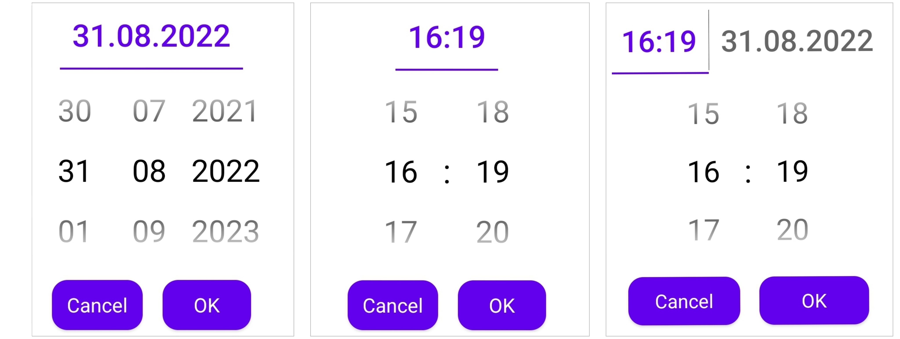

[](https://jitpack.io/#Mobile-Innowise-Group/DateTime-Reel-Picker)
# DateTime-Reel-Picker

A library that provides a reel picker for date and time.
Can be used in 3 ways: 
- date picker only
- time picker only
- date and time picker.

Contains properties for setting date and time min and max ranges.
Also supports input from keyboard, checks and validations for date and time.

<br/>




<br/>


<p align="center">
    <video>
        <source src="./super-sample.mp4" type="video/mp4">
    </video>
</p>


<br/>
<br/>

## Download


Add below lines to root's build.gradle
```gradle
allprojects {
	repositories {
		...
		maven { url 'https://jitpack.io' }
	}
}
```    

Grab via Gradle


```gradle
implementation 'com.github.Mobile-Innowise-Group:DateTime-Reel-Picker:{latest version}'
```

<br/>

## Description

| Method | What it does |
|----------------|---------|
| createTimeDialog | creates a dialog where you can select only time |
| createDateDialog | creates a dialog where you can select only date |
| createDateTimeDialog | creates a dialog where you can select both date and time |
| setOkClickCallback | ok button click callback |
| setCancelClickCallback | cancel button click callback |
| showDialog | shows picker dialog with a chosen type |

<br/>

## Date and Time internal entities

<br/>

**LocalTime:**

<br/>

| Method | What it does |
|-------------|-------------|
| now | sets the current time |
| of | sets the specific time |
| plusMinutes | adds minutes to the selected time |
| minusMinutes | subtracts minutes from the selected time |
| plusHours | adds hours to the selected time |
| minusHours | subtracts hours from the selected time |
| hour | gets selected hour |
| minute | gets selected minute |

<br/>

**LocalDate:**

<br/>

| Method | What it does |
|------------|--------------|
| now | sets the current date |
| of | sets the specific date |
| plusDays | adds days to the selected date |
| minusDays | subtract days from the selected date |
| plusMonths | adds months to the selected date |
| minusMonths | subtracts months from the selected date |
| plusYears | adds years to the selected date |
| minusYears | subtracts years from the selected date |
| day | gets selected day |
| month | gets selected month |
| year | gets selected year |

<br/>

**LocalDateTime:**

<br/>

| Method | What it does |
|-------------|-----------------------|
| now | sets the current date and time |
| of | sets the specific date and time |
| toLocalDate | gets only the date from LocalDateTime value |
| toLocalTime | gets only the time from LocalDateTime value |


<br/>


## Usage


### __Date dialog example:__


#### ***Basic implementation***

#### Kotlin
``` kotlin
ReelPicker
    .createDateDialog()
    .setOkClickCallback(object : ReelPicker.OkClickCallback<LocalDate> {
        override fun onOkClick(value: LocalDate) {
            //do whatever you want with callback value
        }
    })
    .setCancelClickCallback(object : ReelPicker.CancelClickCallback{
        override fun onCancelClick() {
            //do whatever you want
        }
    })
    .showDialog(supportFragmentManager)
```

#### Java
``` java
ReelPicker
    .createDateDialog()
    .setOkClickCallback(value -> {
        //do whatever you want with callback value
    })
    .setCancelClickCallback(() -> {
        //do whatever you want
    })
    .showDialog(fragmentManager)
```
<br/>

#### ***Custom implementation***

#### Kotlin

``` kotlin
ReelPicker
    .createDateDialog(
        initialLocalDate = LocalDate.now().plusMonths(11).minusYears(1),
        minLocalDate = LocalDate.of(13,1,2055).minusDays(5).plusMonths(3),
        maxLocalDate = LocalDate.now().minusMonths(19)
    )
    .setOkClickCallback(object : ReelPicker.OkClickCallback<LocalDate> {
        override fun onOkClick(value: LocalDate) {
            //do whatever you want with callback value
        }
    })
    .setCancelClickCallback(object : ReelPicker.CancelClickCallback{
        override fun onCancelClick() {
            //do whatever you want
        }
    })
    .showDialog(supportFragmentManager)
```

#### Java

``` java
ReelPicker
    .createDateDialog(
        LocalDate.now().plusMonths(11).minusYears(1),
        LocalDate.of(13,1,2055).minusDays(5).plusMonths(3),
        LocalDate.now().minusMonths(19)
    )
    .setOkClickCallback(value -> {
        //do whatever you want with callback value
    })
    .setCancelClickCallback(() -> {
        //do whatever you want
    })
    .showDialog(fragmentManager)
```

<br/>


---


### __Time dialog example:__


#### ***Default implementation***

#### Kotlin

``` kotlin
ReelPicker
    .createTimeDialog()
    .setOkClickCallback(object : ReelPicker.OkClickCallback<LocalTime> {
        override fun onOkClick(value: LocalTime) {
            //do whatever you want with callback value
        }
    })
    .setCancelClickCallback(object : ReelPicker.CancelClickCallback{
        override fun onCancelClick() {
            //do whatever you want
        }
    })
    .showDialog(supportFragmentManager)
```

<br/>

#### Java
``` java
ReelPicker
    .createTimeDialog()
    .setOkClickCallback(value -> {
        //do whatever you want with callback value
    })
    .setCancelClickCallback(() -> {
        //do whatever you want
    })
    .showDialog(fragmentManager)
```


<br/>

#### ***Custom implementation***

#### Kotlin

``` kotlin
ReelPicker
    .createTimeDialog(
        initialLocalTime = LocalTime.of(15, 20).minusMinutes(62),
        minLocalTime = LocalTime.of(3, 18).plusHours(2),
        maxLocalTime = LocalTime.of(22, 52).plusMinutes(30)
    )
    .setOkClickCallback(object : ReelPicker.OkClickCallback<LocalDate> {
        override fun onOkClick(value: LocalDate) {
            //do whatever you want with callback value
        }
    })
    .setCancelClickCallback(object : ReelPicker.CancelClickCallback{
        override fun onCancelClick() {
            //do whatever you want
        }
    })
    .showDialog(supportFragmentManager)
```

#### Java

``` java
ReelPicker
    .createTimeDialog(
        LocalTime.of(15, 20).minusMinutes(62),
        LocalTime.of(3, 18).plusHours(2),
        LocalTime.of(22, 52).plusMinutes(30)
    )
    .setOkClickCallback(value -> {
        //do whatever you want with callback value
    })
    .setCancelClickCallback(() -> {
        //do whatever you want
    })
    .showDialog(fragmentManager)
```

<br/>


---


### __Date and time dialog example:__


#### ***Default implementation***

#### Kotlin

``` kotlin
ReelPicker
    .createDateTimeDialog()
    .setOkClickCallback(object : ReelPicker.OkClickCallback<LocalDateTime> {
        override fun onOkClick(value: LocalDateTime) {
            //do whatever you want with callback value
        }
    })
    .setCancelClickCallback(object : ReelPicker.CancelClickCallback{
        override fun onCancelClick() {
            //do whatever you want
        }
    })
    .showDialog(supportFragmentManager)
```

<br/>

#### Java
``` java
ReelPicker
    .createDateTimeDialog()
    .setOkClickCallback(value -> {
        //do whatever you want with callback value
    })
    .setCancelClickCallback(() -> {
        //do whatever you want
    })
    .showDialog(fragmentManager);
```

<br/>


#### ***Custom implementation***

#### Kotlin

``` kotlin
ReelPicker
    .createDateTimeDialog(
        initialLocalDateTime = LocalDateTime.now(),
        minLocalDateTime = LocalDateTime.of(
            LocalDate.of(1, Month.MAY, 1950),
            LocalTime.now().minusHours(40)
        ),
        maxLocalDateTime = LocalDateTime.of(
            LocalDate.now().plusYears(15),
            LocalTime.of(23, 33)
        )
    )
    .setOkClickCallback(object : ReelPicker.OkClickCallback<LocalDateTime> {
        override fun onOkClick(value: LocalDateTime) {
            //do whatever you want with callback value
        }
    })
    .setCancelClickCallback(object : ReelPicker.CancelClickCallback{
        override fun onCancelClick() {
            //do whatever you want
        }
    })
    .showDialog(supportFragmentManager)
```

#### Java

``` java
ReelPicker
    .createDateTimeDialog(
        LocalDateTime.now(),
        LocalDateTime.of(
            LocalDate.of(1, Month.MAY, 1950),
            LocalTime.now().minusHours(40)
            ),
        LocalDateTime.of(
            LocalDate.now().plusYears(15),
            LocalTime.of(23, 33)
            )
    )
    .setOkClickCallback(value -> {
        //do whatever you want with callback value
    })
    .setCancelClickCallback(() -> {
        //do whatever you want
    })
    .showDialog(fragmentManager);
```


<br/>
<br/>

# Sample

[Sample (MainActivity.kt)](https://github.com/Mobile-Innowise-Group/DateTime-Reel-Picker/blob/main/app/src/main/java/com/innowisegroup/datetimepicker/MainActivity.kt)

<br/>

# License

MIT License


Copyright (c) 2019 Innowise Group


Permission is hereby granted, free of charge, to any person obtaining a copy of this software and associated documentation files (the "Software"), to deal in the Software without restriction, including without limitation the rights to use, copy, modify, merge, publish, distribute, sublicense, and/or sell copies of the Software, and to permit persons to whom the Software is furnished to do so, subject to the following conditions:


The above copyright notice and this permission notice shall be included in all copies or substantial portions of the Software.


THE SOFTWARE IS PROVIDED "AS IS", WITHOUT WARRANTY OF ANY KIND, EXPRESS OR IMPLIED, INCLUDING BUT NOT LIMITED TO THE WARRANTIES OF MERCHANTABILITY, FITNESS FOR A PARTICULAR PURPOSE AND NONINFRINGEMENT. IN NO EVENT SHALL THE AUTHORS OR COPYRIGHT HOLDERS BE LIABLE FOR ANY CLAIM, DAMAGES OR OTHER LIABILITY, WHETHER IN AN ACTION OF CONTRACT, TORT OR OTHERWISE, ARISING FROM, OUT OF OR IN CONNECTION WITH THE SOFTWARE OR THE USE OR OTHER DEALINGS IN THE SOFTWARE.
