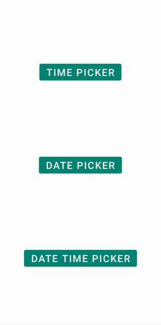

[](https://jitpack.io/#Mobile-Innowise-Group/DateTime-Reel-Picker)
# DateTime-Reel-Picker

A library that provides a reel picker for date and time.
Can be used in 3 different ways: date picker, time picker, date and time picker.
Contains properties for setting the minimum and maximum values.
Supports keyboard input.
Calculates and validates date and time values





<br/>
<br/>
<br/>

## Download


Add below lines to root's build.gradle
```gradle
allprojects {
	repositories {
		...
		maven { url 'https://jitpack.io' }
	}
}
```    

Grab via Gradle
```gradle
implementation 'com.github.Mobile-Innowise-Group:DateTime-Reel-Picker:{latest version}'
```
<br/>

## Description

| Method | What it does |
|----------------|---------|
| createTimeDialog | create a dialog where you can select the time |
| createDateDialog | create a dialog where you can select a date |
| createDateTimeDialog | create a dialog where you can select the date and time |
| setOkClickCallback | make something when ok button clicked |
| setCancelClickCallback | make something when ok button clicked |
| showDialog | show a dialog with a picker |

<br/>

## Usage

В самом начале у вас есть выбор между 3-мя сущностями LocalTime, LocalDate, LocalDateTime.
По дефолту выбирается текущая дата и текущее время, минимальное и максимальное время - 00:00 и 23:59, а также минимальная дата 01.01.1900 и максимальная дата 1.1.2100. Вы можете задать свои значения.

<br/>
LocalTime has methods:


| Method | What it does |
|-------------|-------------|
| now | set time how current |
| of | set certain time |
| plusMinutes | plus minutes to selected time |
| minusMinutes | minus minutes to selected time |
| plusHours | plus hours to selected time |
| minusHours | minus hours to selected time |
| hour | get selected hour |
| minute | get selected minute |

<br/>
LocalDate has methods:


| Method | What it does |
|------------|--------------|
| now | set date how current |
| of | set certain date |
| plusDays | plus days to selected date |
| minusDays | minus days to selected date |
| plusMonths | plus months to selected date |
| minusMonths | minus months to selected date |
| plusYears | plus years to selected date |
| minusYears | minus years to selected date |
| day | get selected day |
| month | get selected month |
| year | get selected year |

<br/>
LocalDateTime has methods:


| Method | What it does |
|-------------|-----------------------|
| now | set date and time how current |
| of | set certain date and time |
| toLocalDate | get only date from LocalDateTime value |
| toLocalTime | get only time from LocalDateTime value |


<br/>

### __DateDialog:__


#### **MainActivity.kt**
```kotlin
ReelPicker.createDateDialog().showDialog(supportFragmentManager)
```

<br/>


If you want you can return value with setOkClickCallback method. You can show it how you want.
<br/>

### __TimeDialog:__


#### **MainActivity.kt**
```kotlin
ReelPicker.createTimeDialog().showDialog(supportFragmentManager)
```


<br/>

### __DateTimeDialog:__


#### **MainActivity.kt**
```kotlin
ReelPicker.createDateTimeDialog().showDialog(supportFragmentManager)
```


<br/>
<br/>

# Sample

[Sample (MainActivity.kt)](https://github.com/Mobile-Innowise-Group/DateTime-Reel-Picker/blob/main/app/src/main/java/com/innowisegroup/datetimepicker/MainActivity.kt)

<br/>

# License

MIT License


Copyright (c) 2019 Innowise Group


Permission is hereby granted, free of charge, to any person obtaining a copy of this software and associated documentation files (the "Software"), to deal in the Software without restriction, including without limitation the rights to use, copy, modify, merge, publish, distribute, sublicense, and/or sell copies of the Software, and to permit persons to whom the Software is furnished to do so, subject to the following conditions:


The above copyright notice and this permission notice shall be included in all copies or substantial portions of the Software.


THE SOFTWARE IS PROVIDED "AS IS", WITHOUT WARRANTY OF ANY KIND, EXPRESS OR IMPLIED, INCLUDING BUT NOT LIMITED TO THE WARRANTIES OF MERCHANTABILITY, FITNESS FOR A PARTICULAR PURPOSE AND NONINFRINGEMENT. IN NO EVENT SHALL THE AUTHORS OR COPYRIGHT HOLDERS BE LIABLE FOR ANY CLAIM, DAMAGES OR OTHER LIABILITY, WHETHER IN AN ACTION OF CONTRACT, TORT OR OTHERWISE, ARISING FROM, OUT OF OR IN CONNECTION WITH THE SOFTWARE OR THE USE OR OTHER DEALINGS IN THE SOFTWARE.
